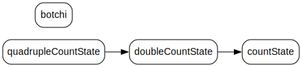

# state-tracer-recoil

Visualize and trace state dependencies in Recoil with an interactive data flow graph.

<p align="center">
  
</p>

## ✨ Features

- ⚛️ Detects `atom`, `selector`, `atomFamily`, and `selectorFamily`
- 🔗 Resolves Recoil dependency graph across multiple files
- 🖼️ Generates a data flow graph as an SVG via the CLI.
- 🎯 Fast and lightweight thanks to [@hpcc-js/wasm](https://www.npmjs.com/package/@hpcc-js/wasm)
- 🧠 Ideal for debugging or understanding large Recoil-based state trees

## 📥 Installation

```console
pnpm add -D state-tracer-recoil
```

## 🛠 Usage

### 1. Generate a data flow graph as an SVG

```console
pnpm str ./src
```

### 2. Open the SVG

```console
open recoil-graph.svg
```

## ⚙️ Options

| Option | Alias | Description | Default |
| -------- | ------------- | ------------- | --- |
| --output | -o | Specify the output path for the generated SVG | recoil-graph.svg |
